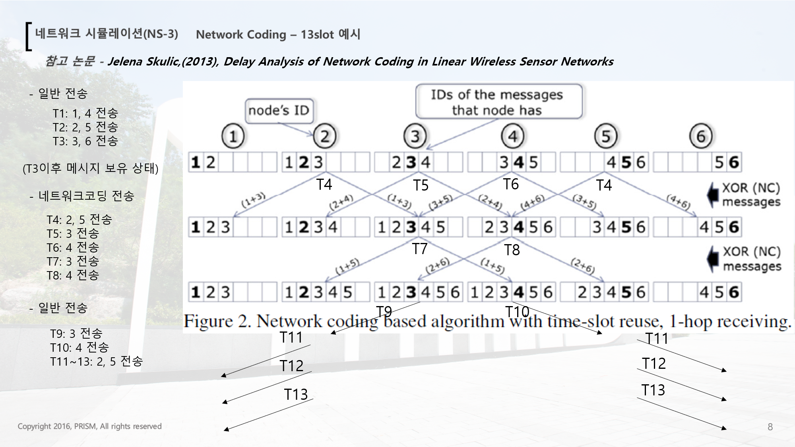

# Linear Wireless Sensor Network 환경에서 Network-Coding
**참고 논문 - Jelena Skulic,(2013), Delay Analysis of Network Coding in Linear Wireless Sensor Networks**
**https://www.nsnam.org/**
NS-3 오픈소스를 활용하여 시뮬레이션을 구축하였으며, 수정한 일부분만 github에 올려두었습니다.

## Network-Coding 특징
* 양쪽 노드들이 동시에 전송할 경우 NetworkCoding을 이용해서 동시에 보낼 수 있도록 한다
* 모든 노드들과 규칙을 정해서 전송 실패하지 않도록 한다.
* 전송할 데이터가 많은 경우 효율이 좋다
* 전송할 데이터가 많이 없는 경우에도 무조건 일정시간을 기다려야한다
</img>
## 주요 코드
* src/network/utils/simple-net-device.cc
